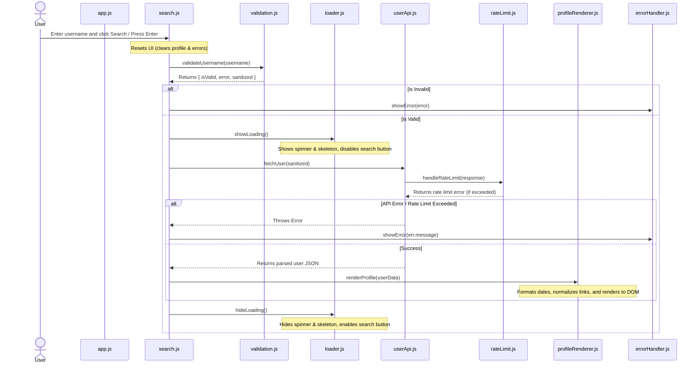

# GitHub Developer Explorer 🔍

A sleek, responsive, and highly modular vanilla JavaScript web application that allows users to search for any GitHub username and explore their developer profile details in real-time. The application directly integrates with the official GitHub REST API, featuring input validation, animated skeleton loading screens, robust error handling, and API rate-limit detection.

---

## 🚀 Key Features

- **Real-Time Developer Search**: Quickly search and fetch any public GitHub profile.
- **Detailed Profile Cards**: View key profile details including:
  - Avatar, full name, and username (with a direct link to their GitHub profile).
  - Public bio, company, location, and blog/website.
  - Profile statistics: public repository count, followers count, and following count.
  - Account creation date (formatted cleanly).
- **Responsive & Modern Design**: Optimized for desktops, tablets, and mobile devices using fluid grid/flexbox layouts and clean typography.
- **Animated Skeleton Loaders**: Shimmering placeholders and spinners provide a smooth, modern loading experience while data is being fetched.
- **Strict Username Validation**: Validates inputs client-side based on actual GitHub constraints (e.g., maximum 39 characters, alphanumeric and single hyphens only, no consecutive hyphens).
- **Graceful Error Handling**: Detects and displays user-friendly errors for network disconnects, invalid inputs, and 404 (user not found) scenarios.
- **API Rate-Limit Awareness**: Parses GitHub API headers to gracefully inform users if they exceed the rate limit, showing the exact time when they can resume searching.

---

## 📂 Project Structure

The project follows a clean separation of concerns, keeping HTML, CSS, and modular JS files isolated.

```text
├── css/
│   └── styles.css              # Custom styling, animations (shimmer, spin), and responsive layout
├── js/
│   ├── app.js                  # Application entry point, initializes modules on DOM load
│   ├── errorHandler.js         # Controls displaying and clearing error messages in the UI
│   ├── loader.js               # Handles loading state, spinner, skeletons, and button states
│   ├── profileRenderer.js      # Formats dates, normalizes URLs, and injects profile HTML
│   ├── rateLimit.js            # Inspects API response headers and handles rate limit failures
│   ├── search.js               # Orchestrates validation, loading states, API fetch, and rendering
│   ├── userApi.js              # Interacts with the GitHub API and handles HTTP response codes
│   └── validation.js           # Validates username format against GitHub rules
├── .gitignore                  # Git ignore rules for node_modules and OS-specific files
├── index.html                  # Main HTML markup and skeleton structure
└── README.md                   # Project documentation
```

---

## 🛠️ Code Architecture

Here is how the modules interact during a typical search request:



---

## 💻 Technical Details

### Frontend Design System
- **Pure Vanilla Tech**: Written entirely in native HTML5, CSS3 (using custom CSS variables/tokens), and modern ES6 JavaScript Modules.
- **Custom Shimmer Animations**: Implements `@keyframes shimmer` on linear-gradient backgrounds to display premium, pulse-like loading skeletons.
- **Semantic HTML**: Fully accessible layouts utilizing `main`, `section`, `form`, `header`, and standard role attributes like `role="alert"` and `aria-live="polite"` for screen readers.

### JS Modules Deep Dive
- [app.js](file:///Users/radheshyambhati/Documents/%20GitHub%20Developer%20Explorer%20/js/app.js): Wait for `DOMContentLoaded` to initialize the search event listener.
- [search.js](file:///Users/radheshyambhati/Documents/%20GitHub%20Developer%20Explorer%20/js/search.js): Binds the form submission handler, calling validation, loaders, API requests, and rendering sequentially.
- [validation.js](file:///Users/radheshyambhati/Documents/%20GitHub%20Developer%20Explorer%20/js/validation.js): Uses regex `/^[a-z\d](?:[a-z\d]|-(?=[a-z\d])){0,38}$/i` to strictly enforce GitHub username rules.
- [userApi.js](file:///Users/radheshyambhati/Documents/%20GitHub%20Developer%20Explorer%20/js/userApi.js): Fetches from `https://api.github.com/users/` and acts as a central handler for HTTP status codes (such as `404` or `403`).
- [rateLimit.js](file:///Users/radheshyambhati/Documents/%20GitHub%20Developer%20Explorer%20/js/rateLimit.js): Checks headers `X-RateLimit-Remaining` and `X-RateLimit-Reset` and prints local time for resetting if rate limit is reached.
- [profileRenderer.js](file:///Users/radheshyambhati/Documents/%20GitHub%20Developer%20Explorer%20/js/profileRenderer.js): Converts ISO strings to localized dates (using `toLocaleDateString()`), prefixes URLs missing protocols, and dynamically populates the Profile Container.
- [loader.js](file:///Users/radheshyambhati/Documents/%20GitHub%20Developer%20Explorer%20/js/loader.js) & [errorHandler.js](file:///Users/radheshyambhati/Documents/%20GitHub%20Developer%20Explorer%20/js/errorHandler.js): Manage UI state visibility by adding and removing class names (e.g. `.hidden`).

---

## ⚡ Setup and Local Execution

Since the project uses standard ES6 JavaScript Modules (`import` / `export`), it must be run using a local web server (opening the `index.html` directly in the browser via `file://` protocol will result in CORS block for local modules).

### Option 1: Live Server (VS Code Extension)
1. Open the project in VS Code.
2. Install the **Live Server** extension.
3. Click the **Go Live** button in the status bar at the bottom right.

### Option 2: Python HTTP Server (CLI)
1. Open terminal and navigate to the project directory:
   ```bash
   cd "/Users/radheshyambhati/Documents/ GitHub Developer Explorer "
   ```
2. Start the HTTP server:
   - For Python 3:
     ```bash
     python3 -m http.server 8000
     ```
   - For Python 2:
     ```bash
     python -m SimpleHTTPServer 8000
     ```
3. Open `http://localhost:8000` in your browser.

### Option 3: Node.js (npx http-server)
1. Run this in terminal:
   ```bash
   npx http-server -p 8000
   ```
2. Open `http://localhost:8000` in your browser.
