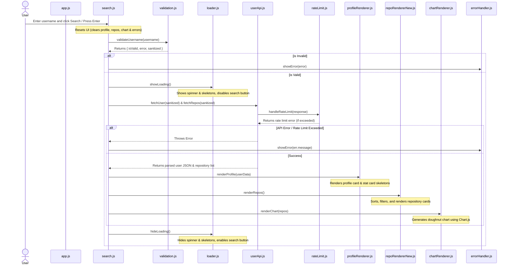

# GitHub Developer Explorer 🔍

A sleek, responsive, and highly modular vanilla JavaScript web application that allows users to search for any GitHub username and explore their developer profile details in real-time. The application directly integrates with the official GitHub REST API, featuring input validation, animated skeleton loading screens, robust error handling, API rate-limit detection, interactive repository sorting/filtering, and language analysis charts.

---

## 🚀 Key Features

- **Real-Time Developer Search**: Quickly search and fetch any public GitHub profile and repository list.
- **Detailed Profile Cards**: View key profile details including:
  - Avatar, full name, and username (with a direct link to their GitHub profile).
  - Public bio, company, location, and blog/website.
  - Profile statistics: public repository count, followers count, and following count.
  - Account creation date (formatted cleanly).
- **Interactive Repository Panel**:
  - Filter repositories dynamically by programming language.
  - Sort repositories by Stars, Forks, Updated Date, or Name.
  - View key statistics like visibility, stargazers, forks, and last-updated times.
- **Doughnut Chart language breakdown**: Generates a beautiful language breakdown chart using Chart.js, adapting to light and dark theme mode, with a customized tooltip and center summary.
- **Light / Dark Theme Toggle**: Adapts the user interface dynamically between premium dark mode and light mode, persisting the user's choice.
- **Responsive & Modern Design**: Optimized for desktops, tablets, and mobile devices using fluid grid/flexbox layouts, CSS variables, glassmorphism, and clean typography.
- **Animated Skeleton Loaders**: Shimmering placeholders and spinners provide a smooth, modern loading experience while data is being fetched.
- **Strict Username Validation**: Validates inputs client-side based on actual GitHub constraints (e.g., maximum 39 characters, alphanumeric and single hyphens only, no consecutive hyphens).
- **Graceful Error Handling**: Detects and displays user-friendly error cards for network disconnects, invalid inputs, and 404 (user not found) scenarios.
- **API Rate-Limit Awareness**: Parses GitHub API headers to gracefully inform users if they exceed the rate limit, showing the remaining requests and exact reset time.

---

## 📂 Project Structure

The project follows a clean separation of concerns, keeping HTML, CSS, and modular JS files isolated.

```text
├── css/
│   └── styles.css              # Custom styling, variables, dark/light themes, animations, and responsive layout
├── js/
│   ├── app.js                  # Application entry point, initializes modules and theme settings on DOM load
│   ├── chartRenderer.js        # Renders the language analysis doughnut chart using Chart.js
│   ├── constants.js            # Holds repository configuration and language color tokens
│   ├── errorHandler.js         # Controls displaying and clearing error cards in the UI
│   ├── loader.js               # Handles loading state, skeletons, and search button statuses
│   ├── profileRenderer.js      # Formats dates, normalizes URLs, and injects profile details & stats grid
│   ├── rateLimit.js            # Inspects API response headers and handles rate limit caching & warnings
│   ├── repoRendererNew.js      # Manages repository sorting, filtering, dynamic HTML generation, and animations
│   ├── search.js               # Orchestrates validation, loading states, API fetch, and rendering pipeline
│   ├── state.js                # Manages and persists global app states (last search, rate-limits) via localStorage
│   ├── userApi.js              # Interacts with the GitHub API and handles HTTP response codes and network errors
│   └── validation.js           # Validates username format against GitHub specifications
├── .gitignore                  # Git ignore rules for node_modules and OS-specific files
├── index.html                  # Main HTML markup and layout skeleton
└── README.md                   # Project documentation (this file)
```

---

## 🛠️ Code Architecture

Here is how the modules interact during a typical search request:



---

## 💻 Technical Details

### Frontend Design System
- **Pure Vanilla Tech**: Written entirely in native HTML5, CSS3 (using custom CSS variables/tokens), and modern ES6 JavaScript Modules.
- **Theme Adaptability**: High-quality light and dark modes toggleable with immediate, persistent application via custom global styles.
- **Custom Shimmer Animations**: Implements `@keyframes shimmer` on linear-gradient backgrounds to display premium, pulse-like loading skeletons.
- **Semantic HTML**: Fully accessible layouts utilizing `main`, `section`, `form`, `aside`, and standard accessibility tags like `role="alert"` and `aria-live="polite"`.

### JS Modules Deep Dive
- [app.js](file:///Users/radheshyambhati/Downloads/GitHub-Developer-Explorer-main/js/app.js): Listens for `DOMContentLoaded` to initialize the search configuration, load persisted application state, and manage UI theme toggling.
- [search.js](file:///Users/radheshyambhati/Downloads/GitHub-Developer-Explorer-main/js/search.js): Binds the form submission handler, coordinating validation, loader animations, parallel API fetches, and view rendering.
- [validation.js](file:///Users/radheshyambhati/Downloads/GitHub-Developer-Explorer-main/js/validation.js): Uses the regex `/^[a-z\d](?:[a-z\d]|-(?=[a-z\d])){0,38}$/i` to strictly enforce GitHub username rules.
- [userApi.js](file:///Users/radheshyambhati/Downloads/GitHub-Developer-Explorer-main/js/userApi.js): Performs concurrent fetches from `https://api.github.com/users/` and acts as a central handler for HTTP statuses and connection checks.
- [rateLimit.js](file:///Users/radheshyambhati/Downloads/GitHub-Developer-Explorer-main/js/rateLimit.js): Monitors and caches response headers (`X-RateLimit-Remaining`, `X-RateLimit-Reset`) to warn users when they approach or exceed limits.
- [profileRenderer.js](file:///Users/radheshyambhati/Downloads/GitHub-Developer-Explorer-main/js/profileRenderer.js): Normalizes bios, external websites, company references, and formats registration dates, rendering the primary profile information and core stats card container.
- [repoRendererNew.js](file:///Users/radheshyambhati/Downloads/GitHub-Developer-Explorer-main/js/repoRendererNew.js): Handles filtering, custom sorting (stars, forks, updated date, name), and renders repository lists with staggered card transition delays.
- [chartRenderer.js](file:///Users/radheshyambhati/Downloads/GitHub-Developer-Explorer-main/js/chartRenderer.js): Handles the lifecycle of the global `Chart` doughnut instance, coloring and labeling data, and drawing interactive text metrics to the center of the canvas.
- [constants.js](file:///Users/radheshyambhati/Downloads/GitHub-Developer-Explorer-main/js/constants.js): Aggregates global theme tokens and custom GitHub language colors.
- [state.js](file:///Users/radheshyambhati/Downloads/GitHub-Developer-Explorer-main/js/state.js): Stores and fetches local application variables (theme, last search query, rate limits) in the user's browser database via `localStorage`.
- [loader.js](file:///Users/radheshyambhati/Downloads/GitHub-Developer-Explorer-main/js/loader.js) & [errorHandler.js](file:///Users/radheshyambhati/Downloads/GitHub-Developer-Explorer-main/js/errorHandler.js): Manage UI state visibility and class modifications (e.g. `.hidden`).

---

## ⚡ Setup and Local Execution

Since the project uses standard ES6 JavaScript Modules (`import` / `export`), it must be run using a local web server (opening the `index.html` directly in the browser via `file://` protocol will result in CORS blocks for local module files).

### Option 1: Live Server (VS Code Extension)
1. Open the project in VS Code.
2. Install the **Live Server** extension.
3. Click the **Go Live** button in the status bar at the bottom right.

### Option 2: Python HTTP Server (CLI)
1. Open terminal and navigate to the project directory:
   ```bash
   cd "/Users/radheshyambhati/Downloads/GitHub-Developer-Explorer-main"
   ```
2. Start the HTTP server:
   - For Python 3:
     ```bash
     python3 -m http.server 8000
     ```
   - For Python 2:
     ```bash
     python -m SimpleHTTPServer 8000
     ```
3. Open `http://localhost:8000` in your browser.

### Option 3: Node.js (npx http-server)
1. Run this in the terminal:
   ```bash
   npx http-server -p 8000
   ```
2. Open `http://localhost:8000` in your browser.
